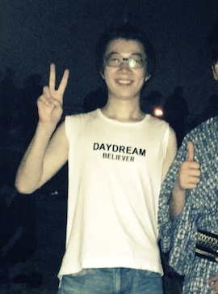

Hello, welcome to kio's spot!

My name is Sijie Shen (or kio my nickname), currently working as an algorithm engineer. I got my BS of Engineer & BS of Art at [Xi'an Jiaotong University](http://www.xjtu.edu.cn/), and MS degree in [The University of Tokyo](https://www.u-tokyo.ac.jp/), majoring in Computer Vision.

Aside from working and coding, I am obsessed with animes, comics and especially GAMES (ACG). I believe the form of game (interactive media) is the complete set of entertainment.

This blog mostly records my learning notes and the parts I stuck in coding. If you find any post helpful, fell free to leave your words in comment area or directly email me at the address below.

### Contact
E-Mail: kiorisyshen@gmail.com
Github: https://github.com/kiorisyshen
